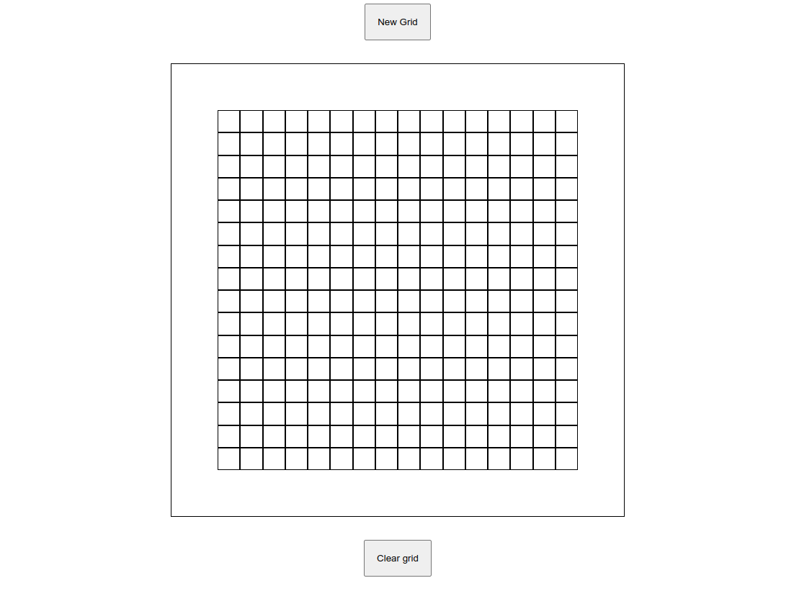

# Etch-a-Sketch [Link to the project on TOP](https://www.theodinproject.com/lessons/foundations-etch-a-sketch)

#### Preview:

#### Description:
* Works like your average etch-a-sketch app, but with a few extra additions.

#### Features:

* Hovering your mouse over the pixels colors the cells the opposite color.

#### Tools:
* HTML
* Javascript
* CSS (Used through Javascript)
* Git
* Github

## Things that I deemed important to remember:

* (HTML) `defer` is a useful keyword if you want your js script to load after everything on the page has fully loaded. Alternatively you can just append the script after the body's definition, but it can still be a bit clean this way.

* (CSS) `box-sizing: border-box;` : Applying this property to every individual grid cell that we created with a for loop in javascript allowed them to neatly fit under the container without growing larger than the container (and overflowing through and outside).

* (Javascript) Using `setAttributes` when you want to change multiple attributes of a specific element, like for instance when you want to style an element that you just created, it's probably easier to use this than to repeatedly type out every aspect of the styling that you want to change.

* (Javascript) Using one event listener on the container will probably save a bit of performance, but it's important to remember when to use one event listener and when to use many. The former can save performance while being somewhat infelxible, and the latter is more flexible, though for our situation here using one event listener on the container is probably sufficient. For our case, it's a `mouseover` event that simply checks if the target is a grid cell (by checking its class name) and simply flipping its color.

